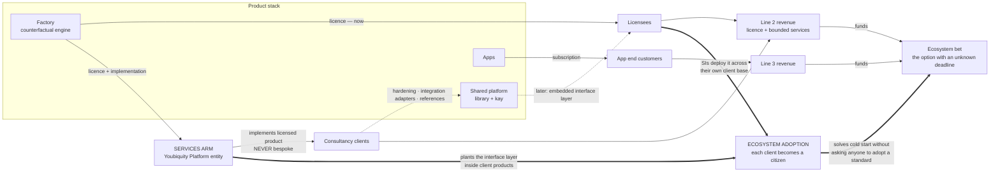
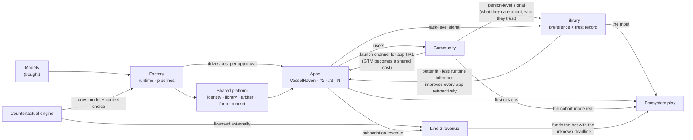

# 01 — Portfolio

*Version 2 — rewritten 2026-09-10. Supersedes the incremental v1; the argument
history lives in git and the retired positions are summarised in the appendix so
they don't get re-litigated.*

---

## What this is

A proposal for the Youbiquity portfolio: what the group is building, where value
accrues, and what has to be true for it to work.

**Audience:** one investor (already in), three co-founders, one prospective
employee. This is an allocation argument among people with full context — where
the next unit of attention and capital goes, and why — not a pitch. Marked
`OPEN` where something is undecided, `ASSUMPTION` where I've inferred, and
`DECIDED` where a call has been made.

---

## The thesis

Youbiquity is **three revenue lines and one option**, built on a bet that the
marginal cost of launching an application falls fast enough to make a portfolio
viable at a headcount that couldn't normally sustain one.

| | **1. Ecosystem** | **2. Core tech** | **3. Apps** |
|---|---|---|---|
| **What** | Four-agent topology with a generative per-person UI: `project-k`, `aux`, `arbiter`, `library`, `market` | The agent stack **licensed**, with services only where licensing needs them | VesselHaven, App #2, #3… |
| **Horizon** | 3–5 yr | Now | 1–2 yr |
| **Risk** | High | Low | Medium |
| **Scales with** | Accumulated preference data | Licensees — **sub-linear if licensed, linear if staffed** | Factory maturity — sub-linear |
| **Role** | The outcome | Runway | Distribution, and proof of the cost curve |

Line 2 is the one to watch — but *how* it is sold decides whether it's a problem.
Sold as embedded consulting it is linear in headcount and wins attention by
default; **licensed**, it has a far better hour:income ratio and scales without
adding people. See §Line 2 should be licensing-led.

### The layer cake

Width is reach. The right-hand column is what each layer sells, and to whom —
without it the diagram is only half the business.

```
        ╔══════════════════════════════════════════════════╗
  L1    ║  THE PERSON — one identity, one profile          ║   not sold
        ╚══════════════════════════════════════════════════╝
        ┌──────────────────────────────────────────────────┐
  L1    │  COMMUNITY                                       │   not sold —
        │  spans every app · the coupling constant         │   it IS the cohort
        └──────────────────────────────────────────────────┘
        ┌───────────┬───────────┬───────────┬──────────────┐
  L3    │VesselHaven│  App #2   │  App #3   │  App N …     │──► end customers
        │  (thin)   │ (thinner) │ (thinner) │ (thinnest)   │    subscription
        └───────────┴───────────┴───────────┴──────────────┘
        ┌──────────────────────────────────────────────────┐
  L1    │  SHARED PLATFORM                                 │┈┈► LATER: library+kay
        │  identity · library · arbiter                    │    embedded in others'
        │  kay + aux · market · ops plane                  │    apps  (B2B2C)
        └──────────────────────────────────────────────────┘
        ┌──────────────────────────────────────────────────┐
  L2    │  FACTORY                                         │──► NOW: counterfactual
        │  runtime · pipelines · verification              │    engine, Claude Code
        │  counterfactual engine                           │    Cloud — licensed
        └──────────────────────────────────────────────────┘
        ┌──────────────────────────────────────────────────┐
        │  MODELS — bought; improve under you              │   n/a
        └──────────────────────────────────────────────────┘

                    L1 ecosystem   L2 core tech   L3 apps
```

**How to read it.**

- **Community is the widest layer that isn't the person**, and the only one that
  reaches *sideways* rather than only up and down — which is what turns N user
  bases into one cohort. It is also, deliberately, **not sellable**: it is the
  cohort, so licensing it would be selling the moat.
- **The apps get thinner left to right.** That is the cost curve, drawn.
- **The Factory is the only layer with no end-user surface** — and the first one
  sold out of the stack.
- **Only the Person layer and the counterfactual engine appreciate** when the next
  model ships. Everything between is commoditising or bought.
- **Revenue lines don't map onto strata.** The ecosystem play is both the top and
  much of the middle; core tech underlies everything; apps are a thin band. An org
  chart drawn from the revenue lines would cut this diagram in the wrong places —
  which is the visual case for the build-versus-apply engineering split in 03.

### The commercial arm — where consulting and licensing sit

**The services arm is not a layer. It is an entity** — Youbiquity Platform (§Entity
shape) — sitting beside the stack and selling slices of it outward. That is why it
was invisible in the cake: the cake is the product, and this is the surface that
sells it.



**Four things this makes explicit that the cake could not:**

1. **Licensing and services are the same motion, not two.** The services arm sells
   a licence *plus* bounded implementation. That is the scope rule from 03 drawn as
   an arrow: implementation of licensed product, never bespoke work — because
   bespoke generates novel problems that escalate past a director to whoever holds
   the architecture.
2. **The dotted arrow back into the platform is why services exist at all.** Client
   deployments produce hardening, integration adapters and reference logos that
   internal use never would. That is the honest argument for *some* services rather
   than none — and the argument stops exactly where bespoke begins.
3. **What is sold changes over time, and moves up the stack.** The Factory is
   licensable now; the library+kay interface layer is the higher-ceiling candidate
   later, and is also the B2B2C distribution channel for the ecosystem play. Same
   arrow, two purposes.
4. **Both revenue lines terminate in the same place.** Line 2 and line 3 exist to
   fund the bet that has no customer creating urgency for it — but an **unknown
deadline** all the same. That is the structure's entire
   logic, and it is the one arrow worth defending when attention gets contested.

### The third role: consulting as ecosystem distribution

The heavy arrows are the ones that matter most, and they were missing.

**A consultancy engagement can plant the interface layer inside a client's
product.** The client becomes an AUX citizen without ever being asked to adopt a
standard — they bought an implementation, and the standard arrived with it. That is
how enterprise middleware and most protocol standards actually spread: consultants
install them.

**And selling to systems integrators is leveraged distribution, not just revenue.**
An SI that standardises on the interface layer as part of its own delivery practice
carries it into dozens of client engagements. One relationship becomes many
installs — **the closest thing to a distribution flywheel available to a
four-person company**, and a direct answer to the standards cold-start problem this
document raised early and never resolved. (Sextant was the earlier answer to cold
start; the wrapper decision in 02 retired that role. This replaces it, and it needs
no permission from anyone.)

That makes the services arm do three jobs at once, and only the first is obvious:

| Role | Output |
|---|---|
| Revenue | Licence + bounded implementation fees |
| Hardening | Adapters, robustness, reference logos that internal use never produces |
| **Distribution** | **Ecosystem citizens, planted one engagement at a time and multiplied through SIs** |

**Three honest caveats, because this arrow is not free:**

1. **Consultant-planted adoption is shallow until the client owns it.** Installed
   as a vendor artifact, it gets ripped out at the next refresh. It counts as
   adoption only when the client's own team extends it.
2. **It accelerates the commitment cap.** More installs means more compatibility
   obligations, sooner — the licensing constraint from §Line 2 bites harder the
   better this works.
3. **It is the most likely route to roadmap capture.** A services-led architecture
   becomes whatever the last client needed. The ecosystem line must keep roadmap
   ownership; delivery gets to inform it, never to set it.

**And a sequencing point that follows from those.** This channel pulls toward
**freezing the architecture** — you cannot install what is still moving. But
`project-k` deliberately holds its product architecture open, and this document has
twice argued that keeping it open produced a better result. So the adoption arrow
is a **later** arrow: valuable, and actively harmful if pulled early, because it
would force a premature freeze on the one bet whose value comes from staying
undecided a while longer.

Use the near-term consulting engagements for revenue and hardening. Switch the
distribution arrow on when the interface layer is stable enough to install — and
treat *that* as the real milestone for the ecosystem play, rather than any internal
architecture decision.

**The two caps belong on this diagram, not in the stack** (03 §Attention
allocation): a **time cap** on bespoke consulting, because it is linear in humans
and generates no compounding data — and a **commitment cap** on licensing, because
what you promise licensees constrains what the architecture is still free to change.

### How the layers feed each other

### How the layers feed each other



**The three loops worth naming**, because they are what makes this a system rather
than a stack:

1. **Factory → apps → factory.** Cheaper apps justify more apps, which justify more
   factory investment. Slow, compounding, and gated by the commercial model (§How
   engineering gets bought).
2. **Apps → community → library → apps.** The core multiplier. App #3 improves apps
   #1 and #2 *retroactively*, because the profile they all read got deeper. Break
   this — apps that don't share a user — and the portfolio becomes addition.
3. **Counterfactual engine → line 2 revenue → ecosystem.** The funding loop. It is
   the only arrow in the diagram that leaves the stack and comes back as money.

And the asymmetry the diagram makes obvious: **community is the only box with three
outbound arrows** — signal to the library, cohort to the ecosystem, and distribution
back to the apps. Nothing else in the system reaches that far, which is why getting
it wrong is expensive in three directions at once.

### The shape of the bets

`PROPOSED (Nathan, 2026-09-10)` — the portfolio is **two large bets and a
constrained tail**:

| | Bet | Clock | Uncertainty | Scope |
|---|---|---|---|---|
| **Ecosystem** | `project-k` + `aux` + `arbiter` + `library` + `market` | **~18–36 months** — see below; not self-paced | High: the product shape is undecided | Unbounded |
| **Core tech** | The counterfactual engine (replay) | **12–18 months, externally set** | Low: it works; the question is commercial | Bounded and known |
| **Apps** | As many as the resource budget allows | Per app | Medium each, low in aggregate | Each one small |

**Both large bets have windows, and neither is open-ended.** No bet in this
document has "no deadline" — some deadlines are dated and some are unknown, which
is a different thing and should never be written as the first.

**Both large bets have windows.** An earlier version of this section treated the
ecosystem bet as self-paced. It isn't. Every component is already shipping
separately — generative UI standards (A2UI, MCP Apps), agentic browsing, Universal
Cart, and an Apache-2.0 commerce-agent blueprint whose skill list includes
*memory-personalisation*. Assembling them in a personalised form is a matter of
time, not of invention.

**But the clock is not "until someone ships the combination". It is "until the
person's profile already lives somewhere else."** That distinction determines what
to do about it. The relevant evidence is possession, not capability:

- All three major assistants rebuilt memory during 2026.
- **Gemini's is account-level** — "Personal Intelligence", rebranded and expanded
  14 January 2026 — so the profile lives in an account the person already has,
  which is the strongest possession play available.
- There is **no cross-vendor portability** by default; profiles are being
  consolidated where the person already is.

Judgement, not measurement: that puts the ecosystem window at roughly **18–36
months** — longer than replay's, because the incumbents' interface is chat and
their scale advantage argues *against* per-person composition, but far short of
self-paced.

### What that implies is different from "go faster"

> **The ecosystem bet's schedule is set by data-accumulation lead time, not by
> build time.** Accumulated behaviour cannot be sprinted later. Architecture can.

So the response is not to accelerate the four-agent build. It is to **start the
data clock now, at low product maturity** — identity, profile schema, community —
because those are what begin accumulating, and every month of delay is a month of
signal that does not exist.

**Revised scheduling rule.** Not "the bet with a deadline wins" — both have one.
Prioritise by **the shape of the loss per unit of delay**:

| | Replay | Ecosystem |
|---|---|---|
| Loss shape | **Step function** — one competitor release removes the differentiation | **Continuous** — each month is un-accumulated signal |
| What delay costs | A market position | Depth that can't be recovered later |
| Correct response | **A burst.** Sprint to a defensible position | **An early start**, which can run at low intensity |

They therefore compete for *different kinds* of attention, which is the resolution:
**start the ecosystem's data clock now, sprint replay, defer the four-agent
architecture.** The thing that cannot be delayed is accumulation; the thing that
can is the architecture around it.

**A refinement that matters for how much of this to believe.** Shallow preference
is already portable — Claude imports memory from ChatGPT, Gemini and Grok, and
third-party universal-memory extensions exist. So "they'll possess the profile
first" is weaker than it sounds *for the shallow layer*. What is **not** importable
is the behavioural record: which recommendations were accepted, which were edited,
what autonomy was granted and then extended. Bullet-point facts move; a trust
history does not. **Depth beats possession — and depth only accrues through use**,
which is the same conclusion by another route.

**And the cost of "intentionally undecided" is now visible.** This document
previously argued against setting a decision date, on the grounds that staying
open produced a better architecture. That still holds for the *architecture*. What
it cannot do is stay open while the data clock runs, because indecision spends the
calendar that accumulation needs. The resolution is the same as above: decide what
is needed to start accumulating, and leave the rest open.

**The two bets are also not independent.** 01 earlier described the ecosystem as
an option whose premium the other lines pay. That is now concrete: **replay is the
funding mechanism** — near-term, horizontal, priced against a bill the customer
already receives. It upgrades line 2 from "runway" to "the thing that buys time
for the bet whose deadline is unknown", which is a stronger reason to prioritise
it than
revenue alone.

**The app tail is a portfolio of options, not a set of products.** Each app is
cheap, mostly modest, occasionally significant — so the arithmetic is number of
shots × cost per shot, which makes the cost curve visceral: at $250k per app a
$500k budget buys **two** shots; at $62k it buys **eight**. The cost curve is not
an efficiency metric, it is *how many tickets you hold*.

Two disciplines follow, neither of which the group has yet:

- **A kill rule.** Options expire; products linger. Without an explicit criterion
  for shutting or parking an app, the tail consumes the budget through operations
  — the asymptote identified in the cost model.
- **A constraint that most option portfolios don't carry.** These are **options on
  a shared cohort, not independent lottery tickets.** Unconstrained shots give
  diversification but no compounding; cohort-constrained shots give compounding
  but concentrate the risk in one population. **This group's thesis requires the
  second**, which means app selection is not "what looks promising" but "what
  deepens the same person". It is a real cost — fewer available shots — paid for
  the multiplier.

### Community is the coupling, not a fourth bet

Community is the only asset that touches all three bets at once, which makes it
structurally different from anything else in the portfolio:

- **To the ecosystem** it supplies the signal that reveals a *person* rather than
  a transaction — the class of data that transfers between domains and that no
  single app produces.
- **To the apps** it converts N separate user bases into **one cohort**. Without
  it, "the apps share a user" is an assertion in a schema. With it, it is a place
  people actually are.
- **To the cost curve** it does something under-priced: it makes app N+1's
  go-to-market a *shared* cost rather than a per-app one. Members recruit members,
  and an existing community is the launch channel for the next app. Go-to-market
  is the largest non-engineering per-app line in the cost model, and community is
  the only lever that moves it.

> **Community is the coupling constant.** Getting it right doesn't add a line
> item — it determines whether the portfolio multiplies or merely adds. Three bets
> bound by a shared cohort are one system; three bets without it are three
> businesses sharing an office.

That is the argument for treating the identity-model decision (QUESTIONS Q1) as
the highest-urgency item in these documents, ahead of both large bets. It is also
the cheapest of the three to get right, and the only one whose window closes on
someone else's schedule — VesselHaven's ship date.

**Ownership, resolved.** The replay bet needs technical depth and a commercial
motion simultaneously, which is why it looked most at risk of being under-owned.
It isn't: Nathan owns technical execution, and the commercial half sits with two
co-founders and an investor who are **former consultants — the capital came from
selling a large consulting firm.**

That is a materially better fit than it first appears, and it changes replay's
prospects more than any technical fact in these documents:

- **Enterprise selling is the least agent-delegable function in the business**
  (03) and the gate on line 2 scaling at all. The group has it in-house, at
  founder level, rather than needing to hire it.
- Scoping, pricing, MSAs, procurement cycles and enterprise security reviews are
  the unglamorous machinery a licensing business runs on. This team has done all
  of it.
- The same skills fix the app-delivery problem: **the shift to fixed-price
  contracting is a discipline ex-consultants already have** — scoping, SOWs,
  milestone acceptance. It's a known path rather than a new competence.

**And it opens a channel that isn't in the stack analysis.** Large consultancies
are an unusually good buyer for the counterfactual engine, and this team can reach
them warm:

- They run coding agents across many client codebases — high inference spend,
  high variance, many simultaneous model retirements.
- They must justify tooling choices to clients, so an evidence artifact has
  procurement value beyond the savings.
- **Agent inference is cost-of-delivery for them, so routing savings convert
  directly into gross margin.** That is a far stronger sales story than "reduce
  your AI bill" — it is margin expansion on work already sold, which is the one
  pitch a consulting P&L owner never declines.

Distribution was the hardest open problem for the replay bet. Between the
founders' network and consultancies as a buyer segment, it is now the
best-supported part of it.

**The risk this creates, stated plainly.** 01 and 03 both name the same failure
mode — line 2 drifting into embedded consulting because it closes faster than
licensing does. **With three ex-consultants on the commercial side, that pull is
now a founding-team trait rather than a market temptation.** Consulting deals will
feel easy and licensing will feel slow, and the instinct will be well-founded in
experience that was earned in a different business model.

A related and gentler question: a consulting firm sells on a multiple of a
people-based EBITDA; a licensing business sells on a multiple of recurring
revenue. The exit that funded this group came from the first kind. If the
group's shared intuition about "what a valuable company looks like" is calibrated
on that, it will bias toward a people business at every fork. Worth surfacing
between the three of you before the caps in 03 have to do the work alone.

### What the ecosystem play might be

`OPEN` — **this is not settled, and earlier drafts of this document stated it
with more confidence than the evidence supports.** `project-k` holds its product
architecture *intentionally undecided*; its ADRs carry `status: proposed`; ADR
0016 reversed the framing of the entire repository once already. What follows is
the current working hypothesis, not a description of a decided thing.

**The working hypothesis** is a program of cooperating agents with a generative
UI layer: an **Arbiter** that decides what to do for a person and owns what gets
asked; a **User Agent** (`library`) that curates that person's knowledge behind a
scope gate; **Kay**, deciding *form, never content*, composing an interface from
atomic primitives; and a **Service Agent** (`market`) reaching the outside world.
`aux` is the protocol seam, plus a reference renderer and design system.

The **collaboration flywheel** is the stated purpose — better signals → better
learning → more trust → more autonomy → more delegation → more signals — and it
is the most durable part of the hypothesis, because it survives most of the
possible product shapes.

**Shapes this could still take**, none excluded by the work done so far:

| Shape | What it would mean |
|---|---|
| **Consumer aggregator** | The scheduling/shopping product as the actual product. Retired in this document as a market position, but not architecturally impossible |
| **Four-agent platform** *(current hypothesis)* | The full topology, with apps as first citizens |
| **Embedded interface layer** | The preference + UI layer licensed into other people's applications; no consumer surface of our own |
| **Preference layer only** | `library` and the trust record as the product; form left to whoever renders it |

These have materially different stacks, org shapes and revenue models, so the
choice eventually forces itself. What is *not* required is choosing now — the
apps and the community accumulate the same person-data under all four, which is
why 01's strategy section leans on the cohort question rather than on the
architecture.

---

## What is actually true today

Stated plainly, because several sections below depend on not overstating it.

| Asset | Reality |
|---|---|
| `project-k` | Knowledge, architecture, ADRs. Product architecture **intentionally undecided**. No application code. |
| `aux` | v0 POC. Flywheel loop verified end to end, renderer tests pass, live model path barely exercised. Nine packages, all form-layer. |
| `arbiter`, `library` | Reference implementations with `src/` and tests. Status: proposed. |
| `market` | **README only.** Created 2026-09-02. The thinnest component, and the one everything external routes through. |
| Cart spike | Real writes at two merchants (Amazon, Total Wine) in the person's own session; aggregated cart over the merchants' real carts; framework-authored recipes armed by a person. **The most evidenced thing in the portfolio.** |
| Sextant | **Theoretical.** 2–4 week evaluation pending. Nothing in this document should be read as depending on it. |
| Claude Code Cloud | Load-bearing, runs daily. |
| VesselHaven | Nearly launched, pre-revenue. ~$250k, ~11 months. One app of many — a muscle-memory exercise, not a strategic relationship. |

---

## Strategy

### The portfolio is the distribution strategy

No single app is the relationship. The factory makes app N+1 cheaper. So the
shape is **many small apps, each cheap, sharing one preference layer.** The
compounding assets are the cross-app preference profile and the cost curve
itself — neither of which lives in any individual app.

This is genuinely unusual positioning. The giants build one interface for
everyone. Vertical SaaS builds one app for one market. Almost nobody builds many
small apps sharing one accumulating model of the person.

### It has exactly one failure mode

> **Do the apps share a user?**
>
> If the same person uses several, the preference layer compounds and app
> selection follows *same person, different need*. If not, the group holds N
> disjoint tiny datasets — a software shop with excellent tooling. A fine
> business, but not this one.

`OPEN` — **name the cohort, not the market.** Who is the person the next three
apps all serve? If they can't be named in a sentence, the cross-app preference
layer is a hope rather than a plan.

### Community is the spine

VesselHaven's marine functionality doesn't overlap with other apps. **Its
community feature does.** That matters more than it sounds: berth booking teaches
you about a vessel; community teaches you about a *person* — what they care
about, whose opinion they trust, how they want to be addressed. That's the signal
class that transfers across domains, and precisely what `library` exists to hold.

Two consequences:

1. **Community is a platform primitive that happens to launch inside VesselHaven
   first.** Build it to be extracted — shared identity, profile, social graph,
   sitting beside `library` — not as a VH module copied into app #2. Getting this
   wrong is paid twice: rebuilding it, and finding the profiles don't join.
2. `OPEN` — **one community, or one per app?** *One community, many apps* is the
   only version where the portfolio compounds. *Many apps, each with a community*
   is N cold starts and N thin datasets. This is an identity-model decision and
   those calcify; it should be settled **before VH's community ships.**

Community is also plausibly the **wedge**: the one thing a generalist agent
cannot supply, because it isn't a capability — it's other people. ChatGPT cannot
give a yacht owner the other yacht owners.

### Wedge and moat are different questions

A moat protects a position you hold. A wedge is why the first cohort shows up at
all. Moats are late-game and made of accumulated data; wedges are early-game and
usually made of *fit* — solving one workflow so specifically that the generalist
is annoying by comparison.

**A wedge is allowed to depreciate.** You use one to buy a relationship, and the
relationship compounds afterwards. What's fatal is investing in a depreciating
asset and expecting it to be the moat.

---

## Line 2 should be licensing-led

An earlier draft described line 2 as "the agent stack sold or leased as a
consulting offering", and then spent several sections worrying that it would eat
the company. Both the framing and the worry were shaped by assuming *consulting*.
**Licensing is a different business with a different shape**, and it is the
better fit for a group whose stated goal is minimising the human core.

| Model | hour : income | Scales by | Cost to serve |
|---|---|---|---|
| **Licensing** | **Best** | Adding licensees | Docs, versioning, support tiers — written once, amortised across all |
| Fixed-price projects | Middling | Adding projects, at falling cost per project | Delivery per engagement, but capped |
| Embedded consulting / T&M | **Worst** | Adding people | Embedded staff, account management — linear, forever |

**What is licensable today, in rough order of readiness:**

| Asset | Licensable as | Readiness |
|---|---|---|
| **Turn-level counterfactual engine** (session replay + perturbation) | The measurement layer under model routing: what *would* have happened at turn K under a different model, prompt or tool — on the customer's own workload. Routers choose forward and never see the road not taken | **Works; Phase 1 building.** Horizontal, priced on measured savings, no strategic buy-in, and routers/harnesses become channels rather than competitors (02 §Session replay) |
| Claude Code Cloud (`llm-slack-channel-bridge`) | Agent runtime + control plane for teams running agent fleets | Load-bearing internally; needs packaging |
| ProductLens / Archon | Work layer for agent-executed delivery | Parked; would need un-parking |
| Sextant | Verification / acceptance oracle | Theoretical — do not sell what isn't real |
| **`library` + Kay — the per-person interface layer** | Embedded into someone else's application | Earliest-stage, highest ceiling |

**The last row matters more than the others, because it collapses two lines into
one.** Licensing the preference-and-interface layer *into other people's apps* is
precisely the B2B2C channel this document proposes as line 1's distribution
strategy. Under that reading, licensing is not a side business that competes with
the ecosystem play for attention — **it is the ecosystem play's go-to-market**,
and the revenue arrives years before a consumer surface would.

That is the strongest argument in this document for line 2 as currently
constituted, and it inverts the earlier treatment of it as a necessary evil.

**What licensing still costs, stated honestly** — this is not free money:

- **Packaging.** Internal-facing tools are not licensable products. Something has
  to become installable, configurable and documented by someone other than its
  author.
- **Versioning and compatibility.** Once a licensee depends on an interface, you
  can no longer break it weekly. This is a real constraint on a research-stage
  architecture, and it argues for licensing the *stable* assets first and keeping
  `project-k`/`aux` free to move.
- **Support, tiered.** Bounded and shared across licensees, unlike consulting —
  but not zero.
- **A sales motion.** Licence revenue per customer is lower than consulting
  revenue per customer, so it needs more customers, which needs a repeatable way
  to find them. That is the one part that does eventually want a human.

**Therefore, revised controls.** The cap in the earlier draft was aimed at
consulting hours. Licensing needs a different control: **roadmap discipline** —
what you promise licensees constrains what you can change. Cap the *commitments*,
not the revenue.

`OPEN` — which asset is licensed first, to whom, and on what pricing basis
(per-seat, per-app, per-end-user, revenue share)? The answer determines whether
line 2 funds the ecosystem play or becomes it.

---

## Where value accrues

### The model-curve test

For any proposed investment: **does this get more or less valuable when the next
frontier model ships?** Capability gaps depreciate — you're betting against the
curve. Accumulated assets appreciate.

| | Next model ships → | |
|---|---|---|
| Reliability scaffolding, recipes | Subsumed | **Depreciating** |
| Drivers, reach, integrations | Subsumed, and identity-gated besides | **Depreciating** |
| Generative UI mechanics | Subsumed — A2UI, MCP Apps | **Depreciating** |
| Per-person preference data | Worth more | **Appreciating** |
| Domain data the giants don't hold | Worth more | **Appreciating** |
| Earned-autonomy / trust record | Worth more | **Appreciating** |
| Customer relationships in a vertical | Unaffected | **Durable** |

**Build what appreciates. Wrap what depreciates. Time-box anything whose value
assumption is "models won't do this well soon."**

Applied: build `library`, the trust/autonomy record, community, and domain-data
capture inside the apps. Wrap `market`, the model, and reliability scaffolding.
Keep the cart spike for the preference signal it generates and as proof the
topology works — not as a capability demo, because the capability is on the curve.

### The proprietary layer has two halves

| | **Per-person preference** | **Per-scenario elicitation** |
|---|---|---|
| Owner | `library` | `arbiter` |
| Compounds | Per user | **Across all users** |
| Buys | Retention, switching cost | Quality on a new user's *first* session |

Consistency is why this must be owned rather than delegated to a stock model: an
interface that asks different questions on Tuesday than Monday can't accumulate
trust, which is the flywheel's only currency.

**Performance is the same asset viewed twice.** ADR 0026 already has Kay
*selecting* rather than generating — a pure exhaustive switch resolving the same
shape to the same pattern, with model-assisted composition behind a flag. That's
snappiness by construction. The principle: **latency is what you pay for missing
knowledge.** The flag is where latency re-enters, and it should carry an explicit
latency budget.

### `DECIDED` — `market` wraps, it does not build

Integration breadth scales with headcount and capital and is copyable. Four
people don't out-scan a hundred. `market`'s contract is already C10
find-candidates / C9 effect — an interface over execution, not a driver library —
so this is a build decision, not a re-architecture.

What the wrapper must still own, or it's a dependency rather than a strategy:

- **Two live provider implementations.** One is not an abstraction.
- **Outcome verification.** A pass-through that can't confirm its own effects
  owns the blame and none of the control.
- **Per-provider quality signal**, so substitution is evidence-driven.
- **The interaction record.** Providers see the action; they never see the
  approve/edit/feedback loop. That's the flywheel's input and the one thing no
  execution vendor can reconstruct.

---

## Economics

### The cost curve is the strategy, not a metric

| | Cost | Elapsed |
|---|---|---|
| VesselHaven (actual) | ~$250k | ~11 months |
| App #2 (target) | ≤$125k | ≤5.5 months |
| App #3 (target) | ≤$62k | ≤3 months |
| **Floor** | **`OPEN`** | **`OPEN`** |

**The floor is the only number that matters.** If halving held forever, every app
Youbiquity will ever build would cost ~$500k in total. It won't — there's a floor
F, and past the first few apps N apps cost roughly $500k + N × F. **F alone
decides how many apps the portfolio can hold**, and therefore whether this is a
strategy or a slogan. At 20% improvement per app rather than 50%, the series never
converges — app #6 still costs $82k. That gap is the difference between a
portfolio and a software shop.

**What compresses, and what doesn't:**

| Component | Compresses? |
|---|---|
| UI/UX design and build | **Strongly** — Kay/AUX, the biggest lever |
| Auth, payments, notifications, infra | **Strongly** — shared services, one-time |
| Integrations | Yes — the wrapper decision |
| QA / verification | *Unproven* — Sextant is theoretical |
| Domain modelling | **Weakly** — only if app #2 serves the same cohort |
| Content seeding, go-to-market, support | **No — and grows with app count** |

That last row is where the wall probably is: **the asymptote is operational, not
engineering.** Build cost falls while the cost of operating N apps rises roughly
linearly. Portfolio strategies die of operations long before they die of
engineering.

### Payback

At ~$250k and no take rate, break-even on build alone is roughly a thousand
sustained subscribers per app for a year at $20/month. Worth sanity-checking
against realistic cohort sizes **before** app #2 is chosen — it may rule out
small verticals entirely.

`OPEN` — monetisation: subscription, B2B licensing to app owners, or per-vertical
SaaS?

### VesselHaven is not a clean baseline

The acceleration tooling was built *during* VH, and adoption was contested. The
$250k/11 months bundles building the factory with using it. **App #2 is the first
real measurement the group will ever have** — instrument it accordingly, and
define the measurement before it starts: what counts in the money (contractors,
founder time at what rate, agent spend, infra, design, licences), what counts as
"released", what counts as the start.

`DECIDED (proposed)` — **pre-commit the failure threshold.** If app #2 lands above
~$150k or beyond ~7 months, treat it as evidence against the portfolio strategy
rather than a one-off overrun, and revisit before starting app #3.

---

## How engineering gets bought

This is a portfolio question, not an operations detail — it currently gates the
entire cost curve.

> **Under time-and-materials, the buyer captures none of the productivity gain.**
> A tool that doubles a contractor's output becomes their leisure, not
> Youbiquity's cost reduction. If adoption reduces billed hours, the vendor's
> revenue falls — so a body-shop isn't merely indifferent to the factory, it is
> **rationally opposed** to it.

No tooling or advocacy survives that. And the deeper version: an hourly agency's
business model is *selling hours* while the strategy is *reducing hours*. You can
align one project. You cannot align a relationship.

| Option | Captures gain? | Cost |
|---|---|---|
| Fixed price per deliverable | Yes | Scope disputes; needs checkable acceptance criteria |
| Target cost + gainshare | Partly | More complex to administer |
| Equity/employment for continuing people | Fully | Fixed cost — but a small owning core is the goal anyway |
| New partner, fixed-price from day one | Yes | Loses continuity; confounds app #2 as a measurement |
| Agents + thin human review | Eliminates the question | Unproven at whole-app scale |

**Youbiquity is unusually well-placed for fixed-price.** Such engagements
normally degenerate because "done" is arguable; this group produces ADRs, specs,
the C5–C10 contracts and invariants — an artifact set that makes acceptance
substantially more checkable. The architecture is incidentally a procurement
asset. *(Sextant would make acceptance machine-verifiable and strengthen this
considerably — do not price that in until it's real.)*

**Cheapest diagnostic available: ask the incumbent for a fixed-price bid on app
#2.** A vendor who won't price their own output is telling you they don't believe
the tools help or don't intend to use them. The question resolves without a
confrontation about hours.

**The window is open now.** The cheapest moment to change a commercial model is a
project boundary. If app #2 starts on T&M, the terms carry for another cycle.

---

## Entity shape

```
                 Youbiquity Group  (umbrella / holdco)
                 - investor equity; owns and licenses down all IP
                 - employs the human core
                 - INCUBATES the ecosystem play (no entity yet)
                            |
            +---------------+---------------+
            |                               |
   Youbiquity Platform            Youbiquity Apps  ("App Portfolio")
   (core tech; licensing +               |
    services revenue)               +-----+-----+
                                      |           |
                                 VesselHaven   App #2, #3...
```

- **VesselHaven is a grandchild, not a direct subsidiary.** It keeps each vertical
  individually disposable: a buyer acquires a clean entity holding the app, its
  contracts and its customers, while the platform IP that built it stays in the
  group and keeps serving every other app. A direct subsidiary with entangled IP
  forces a carve-out at sale time, under pressure, with the buyer's lawyers
  setting the pace.
- **Platform IP sits at Group level and licenses down.** Much cheaper to
  establish pre-revenue than to restructure later.
- **The ecosystem play stays in the Group** until the first of: capital specific
  to it, something worth protecting, or a partner requiring a counterparty. Note
  an open protocol plus a closed preference layer may eventually want two homes.

`OPEN` — jurisdiction and existing entities. The shape is jurisdiction-neutral;
the IP licensing mechanics are not, and transfer pricing will shape them.

---

## Risks

1. **The apps don't share a user** — the portfolio becomes N disjoint datasets.
   The single largest risk, and it's answerable now rather than discoverable later.
2. **The cost curve doesn't bend**, because the commercial model prevents it.
   Currently the binding constraint.
3. **Operational asymptote** — support, GTM and compliance grow linearly with app
   count and eat the build savings.
4. **Platform risk** — wrapping execution providers means their terms, their
   granularity, their roadmap, and the possibility they build the preference/UI
   layer themselves. Mitigated only by two live implementations and by owning the
   interaction signal.
5. **Identity gating.** From 15 Sept 2026 Cloudflare blocks Agent-classified bots
   by default on ad-serving pages for new domains; Shopify rate-limits agents
   without a signed identity while the incumbents' agents sign theirs. Reach is
   being allocated to recognised players — an argument for wrapping one.
6. **Standards competition** — A2UI, MCP Apps and Open-JSON-UI occupy AUX's
   ground; Anthropic ships an Apache-2.0 commerce-agent blueprint including
   memory-personalisation. Don't expect to win on protocol design.
7. **Legal posture on co-browse.** It's the one execution mode that degrades
   gracefully under identity gating, and the one a merchant could characterise as
   routing around its controls. The Ninth Circuit's reversal of Amazon's
   injunction against Perplexity helps; the case is unresolved. Make it a
   deliberate posture with legal input.
8. **Line 2 is sold as consulting rather than licensed.** Embedded delivery in
   *other people's* domains generates no compounding data while consuming the
   attention that would. The risk is the sales model, not the line itself.
9. **Licensing commitments freeze a research-stage architecture.** The mirror
   risk: licensees who depend on `aux` or `project-k` interfaces before those
   interfaces should stop moving. License the stable assets first.

---

## What has to be true

Ordered by how much rests on each.

1. **The apps share a user.** Everything compounding depends on it. Unevidenced.
2. **Delegation compounds** — people grant more autonomy as trust accrues. v0
   proved the mechanism, explicitly not learning at scale.
3. **App #2 costs ≤$125k in ≤5.5 months**, and the decomposition shows why.
4. **The commercial model can change**, or (3) is unreachable regardless of tooling.
5. **Someone else's execution layer is good enough to wrap.** Testable now — the
   spike drives real writes at two merchants.
6. **Operations stay sub-linear in app count.**

---

## Appendix — retired positions

Kept so they don't get re-argued. All were live at some point in the analysis.

| Position | Why it was retired |
|---|---|
| The factory is the flagship | It's a building block; the ecosystem play is the centre of gravity |
| `aux` is the co-browse "hands" | `aux` is the agent-to-UI protocol; co-browse is a separate Service Agent capability |
| Sell Sextant as a self-serve product | Self-serve productisation adds human-shaped work that fights the minimal core. *Partially superseded:* **licensing** to a small number of negotiated customers is a different proposition and is now the preferred line-2 model — but not for Sextant until it is real |
| `market` builds a driver library | Arms race against 10–100× headcount |
| Sextant as the AUX adoption bridge | Needs source access; and the wrapper decision removed the need |
| "Act in the person's own accounts" as a niche | Industry standard — OpenAI deprecated Instant Checkout Mar 2026; UCP Identity Linking Apr 2026 |
| "Clean aggregation" as a niche | Google Universal Cart, May 2026 — Nike, Target, Walmart, Sephora, Wayfair |
| "Permission-free reach" as a niche | Any computer-use agent does it; Ninth Circuit lifted Amazon's injunction |
| "Reliability scaffolding" as a niche | On the model curve — 80% was a generation-old model |
| Generative UI mechanics as a niche | A2UI, MCP Apps, native composition |
| Marine as the domain to compound in | VesselHaven is one app of many, not a relationship |
| "The moat is a relationship in a domain" | True for a company that has one; premature for a company that doesn't. Replaced by wedge-then-moat |

**Sources.** [Agentic commerce protocols, Instant Checkout deprecation, UCP Identity Linking](https://opascope.com/insights/ai-shopping-assistant-guide-2026-agentic-commerce-protocols/) ·
[Google Universal Cart](https://www.digitalcommerce360.com/2026/05/20/google-universal-cart-for-agentic-commerce/) ·
[Grok Bot shopping](https://www.axios.com/2026/06/03/exclusive-spacexai-and-gopuff-help-you-shop-for-more-stuff) ·
[Claude Commerce Agents](https://www.marktechpost.com/2026/09/03/anthropic-released-claude-commerce-agents-an-apache-2-0-blueprint-for-shopping-and-merchant-agents-across-retail-travel-telecom-and-entertainment/amp/) ·
[Generative UI, A2UI, MCP Apps](https://www.copilotkit.ai/blog/the-developer-s-guide-to-generative-ui-in-2026) ·
[Amazon v. Perplexity injunction](https://www.cnbc.com/2026/03/10/amazon-wins-court-order-to-block-perplexitys-ai-shopping-agent.html) ·
[Ninth Circuit reversal](https://www.engadget.com/2230471/perplexity-has-successfully-overturned-amazon-injunction-on-its-ai-shopping-bot/) ·
[Cloudflare AI traffic defaults](https://developers.cloudflare.com/changelog/post/2026-07-01-ai-traffic-options/) ·
[Cloudflare signed agents](https://blog.cloudflare.com/signed-agents/) ·
[WebRetriever real-site success rates](https://arxiv.org/pdf/2607.06118) ·
[WebArena](https://www.emergentmind.com/topics/webarena-benchmark) ·
[Browser Use benchmark](https://browser-use.com/posts/ai-browser-agent-benchmark)
